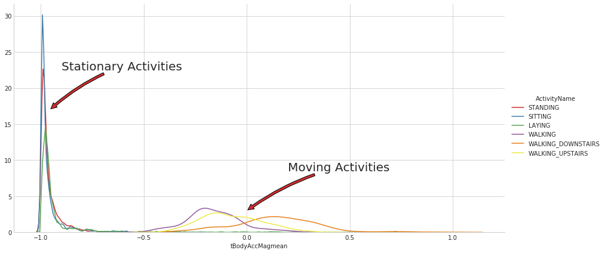

# Human-Activity-Recognition-using-Deep-Learning-Models

 Human activity recognition, or HAR for short, is a broad field of study concerned with identifying the specific movement or action of a person based on sensor data. The objective of this project is to build a classifier using deep learning models to classify six human
activities like sitting,standing,laying known as static activities and walking,walking upstairs,walking downstairs know as dynamic activities

<h4> About Data </h4>

The dataset was made available and can be downloaded for free from the UCI Machine Learning Repository,
<a href="https://archive.ics.uci.edu/ml/datasets/human+activity+recognition+using+smartphones">Human Activity Recognition Using Smartphones Data Set, UCI Machine Learning Repository</a>.

they have recorded this data from two types of sensors which present in our smart phones,one is accelerometer and other is gyroscope.
 from these two sensors and the data is tri-axial i.e., x,yand z accelerometer(linear acceleration) and gyroscope(angular velocity) from these sensors.Observations were recorded at 50 Hz (i.e. 50 data points per second).Each subject performed the sequence of activities twice, once with the device on their left-hand-side and once with the device on their right-hand side.

 
The raw data is not available. Instead, a pre-processed version of the dataset was made available. The pre-processing steps included:

 <ul>
  <li>Pre-processing accelerometer and gyroscope using noise filters.</li>
  <li>Splitting data into fixed windows of 2.56 seconds (128 data points) with 50% overlap</li>
  <li>Splitting of accelerometer data into gravitational (total) and body motion components,i.e,. sensor acceleration signal which has gravitational and body motion components,was seperated by using Butterworth low pass filterinto body acceleration and gravity.</li>
 </ul>
 <h4>Information about features:</h4>
 
For each record in dataset is provided:
  <ul>
    <li>Triaxial acceleration from the accelerometer (total acceleration) and the estimated body acceleration</li>
    <li>Triaxial Angular velocity from the gyroscope.</li>
    <li>A 561-feature vector with time and frequency domain variables.</li>
    <li>Its activity label.(WALKING, WALKING_UPSTAIRS, WALKING_DOWNSTAIRS, SITTING, STANDING, LAYING).</li>
    <li>An identifier of the subject who carried out the experiment.</li>
  </ul>
  <h4>Some insights into data:</h4>
  

  <ul>
    <li> Number of data points per Activity.</li>
    
    <li>Plotted tBodyAccMag_mean feature find some interesting plot that we can divide activities into stationary and Moving(Dynamic) see below plot</li>
   
   <li>Magnitude of an acceleration can saperate it well - See below plot</li>
   
   <li>tried t-sne visualization with perplexity 50 and max-iter 2000 we acn see that difficult to classify the activities sitting and standing</li>
   
   <h3>Deep Learning Model</h3>
   <h4>Single Lstm layer model with Drop out</h4>
   
There are three main signal types in the raw data: total acceleration, body acceleration, and body gyroscope. Each has three axes of data. This means that there are a total of nine variables for each time step,Further, each series of data has been partitioned into overlapping windows of 2.65 seconds of data, or 128 time steps,This means that one row of data has (128 * 9), or 1,152, elements
   
Data heretried grid search and found best model with 'batch_size': 8, 'dropout_rate': 0.5, 'hidden_units': 64, 'init_mode': 'glorot_uniform' parameters and trained the model finally got accuracy of 90%,below is test data confusion matrix.

   
   <h4>Multi layered Lstm Model (upto 4 Layers)</h4>
   
tried 4 layerd lstm model with and 2 fully connected layers with dropout 0.5 ang number of units all are 32,this model attains 89%
    accuracy on test data

   
   <h4>Divide and Conquer-Based with 1D CNN </h4>
   <ul>
    <li>The idea for this Divide and Conquer 1D CNN taken from this paper,<a href="https://www.ncbi.nlm.nih.gov/pmc/articles/PMC5949027/">Divide and Conquer-Based 1D CNN Human Activity Recognition Using Test Data Sharpening</a>
     <li>according to this approach there are two levels ,first level the classifier is like a binary classifier trained to predict wether it is static event or dynamic event we can eaisly predict this beacuse we can see this from above insights from data.once a data point is determined either a static or dynamic then this data point given to coresseponding second level classifier to detect the original activity.this flow depicted in the following diagram</li>
    <
   
   
   
   
   
    
    
  
 
  
